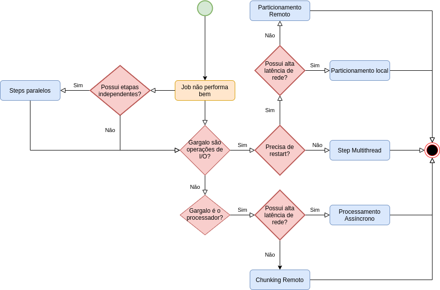

    
     </a>  
     
       
     
     
  

  <h2 align="center"> Spring Batch Performance </h2>

## Introdução

Este repositório contém projetos focados na otimização de performance de jobs usando Spring Batch. O Spring Batch é um framework robusto para processamento em lote, essencial para lidar com grandes volumes de dados de forma eficiente. A otimização de performance no Spring Batch envolve diversas estratégias para garantir que os jobs sejam executados o mais rápido e eficientemente possível. Este README fornece um guia abrangente para entender e implementar essas técnicas de otimização de performance.

## Tabela de Conteúdos

- [Visão Geral do Spring Batch](#visão-geral-do-spring-batch)
- [Estratégias de Otimização de Performance](#estratégias-de-otimização-de-performance)
    - [Steps Paralelos](#steps-paralelos)
    - [Remote Chunking](#remote-chunking)
    - [Processamento Assíncrono](#processamento-assíncrono)
    - [Multithreading](#multithreading)
    - [Partitioning Local](#partitioning-local)
- [Fluxograma de Decisão](#fluxograma-de-decisão)
- [Exemplos](#exemplos)
- [Conclusão](#conclusão)

## Visão Geral do Spring Batch

Spring Batch é um framework leve e abrangente projetado para habilitar o desenvolvimento de aplicações de lote robustas, vitais para as operações diárias de sistemas empresariais. Ele fornece funções reutilizáveis que são essenciais para o processamento de grandes volumes de registros, incluindo logging/tracing, gerenciamento de transações, estatísticas de processamento de jobs, reinício de jobs, skipping e gerenciamento de recursos.

## Estratégias de Otimização de Performance

### Steps Paralelos

Os steps paralelos permitem que múltiplos steps sejam executados simultaneamente, o que pode reduzir significativamente o tempo total de execução de um job. Isto é particularmente útil quando os steps são independentes uns dos outros.

**Implementação:**

- Configure o job para usar um Split para executar steps em paralelo.
- Assegure-se de que os steps não compartilhem recursos que possam causar contenção.

### Remote Chunking

O remote chunking envolve distribuir o processamento de chunks para workers remotos. Isso pode ser benéfico quando a lógica de processamento é intensiva em CPU e pode ser paralelizada em múltiplos nós.

**Implementação:**

- Utilize Spring Integration para configurar a comunicação entre os nós mestre e trabalhadores.
- Configure o job para enviar chunks para workers remotos processarem.

### Processamento Assíncrono

O processamento assíncrono permite que os steps sejam executados de forma assíncrona, o que pode melhorar a performance ao não bloquear a thread principal enquanto espera por um step ser concluído.

**Implementação:**

- Use `TaskExecutor` para executar steps de forma assíncrona.
- Assegure-se de tratar corretamente a conclusão do step e cenários de erro.

### Multithreading

O multithreading pode ser usado para processar múltiplos itens dentro de um step de forma simultânea. Isto é útil para steps que envolvem operações de I/O ou outras tarefas que podem ser paralelizadas.

**Implementação:**

- Configure o step para usar um `TaskExecutor` para multithreading.
- Assegure a segurança das threads ao acessar recursos compartilhados.

### Partitioning Local

O partitioning local envolve dividir os dados em partições e processar cada partição em paralelo. Isso pode ser útil quando os dados podem ser facilmente particionados e processados de forma independente.

**Implementação:**

- Use um `Partitioner` para dividir os dados em partições.
- Configure o job para processar cada partição em paralelo.

## Fluxograma de Decisão

O seguinte fluxograma fornece um processo de decisão para otimizar a performance de jobs no Spring Batch:

1. **Steps Paralelos:** Verifique se o job tem steps independentes.
2. **Gargalo são operações de I/O?:** Determine se o gargalo é devido a operações de I/O.
3. **Gargalo é o processador?:** Determine se o gargalo é o processador.
4. **Possui alta latência de rede?:** Verifique se há alta latência de rede.
5. **Precisa de restart?:** Determine se o job precisa ser reiniciado.

Dependendo das respostas, o fluxograma sugere diferentes estratégias de otimização como steps paralelos, remote chunking, processamento assíncrono e multithreading.

## Exemplos

Este repositório inclui vários projetos de exemplo demonstrando as diferentes estratégias de otimização de performance:

- **Exemplo de Steps Paralelos:** Demonstra como configurar e executar steps paralelos.
- **Exemplo de Remote Chunking:** Mostra como configurar o remote chunking usando Spring Integration.
- **Exemplo de Processamento Assíncrono:** Fornece um exemplo de execução de steps assíncronos.
- **Exemplo de Multithreading:** Ilustra como usar multithreading dentro de um step.
- **Exemplo de Partitioning Local:** Demonstra como particionar dados e processar partições em paralelo.

## Conclusão

Otimizar a performance de jobs no Spring Batch é crucial para lidar com grandes volumes de dados de forma eficiente. Utilizando estratégias como steps paralelos, remote chunking, processamento assíncrono, multithreading e partitioning local, você pode melhorar significativamente a performance dos seus jobs.

## Desenvolvedor
<table>
  <tr>
    <td align="center">
      <a href="#">
         
        
          <b>Rafael Vieira</b>
        
      </a>
    </td>
  </tr>
</table>
<table>
  <tr>
    
    
    
  </tr>
</table>

## 📝 Licença

Esse projeto está sob licença. Veja o arquivo [LICENÇA](LICENSE.md) para mais detalhes.

##  Versões do README

[⬆ Voltar ao topo](#introdução) 
